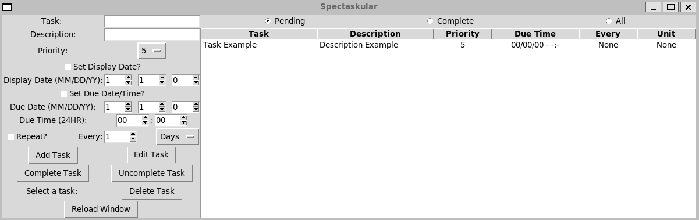

# spectaskular
Task management program that allows the set of display date, due date/time, and priority.

The newer versions of python should come with SQLite3 and Tkinter but if not do  
pip install tk  
or  
pip3 install tk

The program does utilize tktimepicker  
pip install tkTimePicker  
or  
pip3 install tkTimePicker 

To run type "python main.py" while in the directory for the project.  

A new database.db file will be created in the folder directory. This is the SQLite3 database that the application uses. If you every want a fresh start you can delete that file and a new one will be created.

Pending tasks only display tasks in which the display date is less than or equal to the current date.
If you add a task with a display date that is in the future it will not show up on Pending tasks, but will show up on All tasks.
Likewise, if you have a task repeat, the display time gets updated when completing the task, which may cause a display time in the future thus dropping the task off of Pending until that date comes.
The default display date is the current date.

  
  
  
If you want an executable for the application and not have it run on python you can use pyinstaller.  
pip install pyinstaller  
or  
pip3 install pytinstaller
Then while your terminal is in the directory of the appliation run  
pyinstaller --onefile main.py  
once that is complete move the .exe file from the disc directory into the main directory.